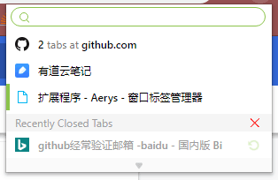
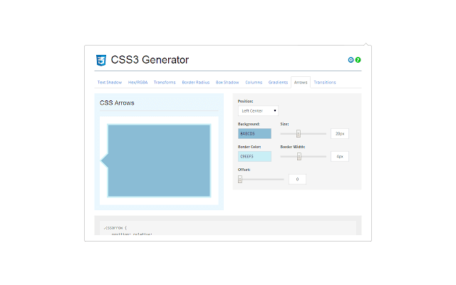
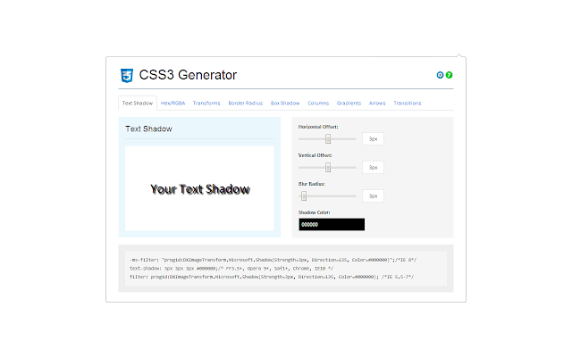
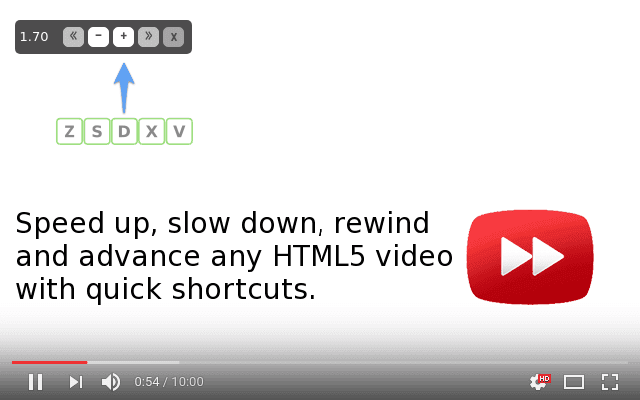
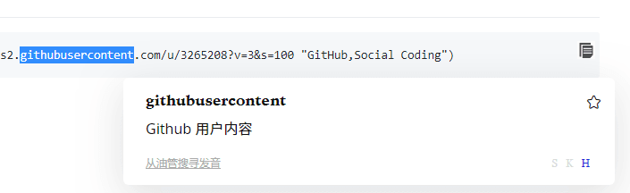

<h1 align="center">生产力（chrome-extension篇）</h1>

## 目录

- [Aerys - 窗口标签管理器](#Aerys - 窗口标签管理器)

- [bark](#bark)

- [Full Page Screen Capture](#Full Page Screen Capture)

- [spider](#spider)

- [Tampermonkey](#Tampermonkey)

- [Toby for Chrome](#Toby for Chrome)

- [uBlock Origin](#uBlock Origin)

- [Video Speed Controller](#Video Speed Controller)

- [WEB前端助手(FeHelper](#WEB前端助手(FeHelper))

- [购物党自动比价工具](#购物党自动比价工具)

### [Aerys - 窗口标签管理器](https://chrome.google.com/webstore/detail/aerys-tab-manager/kclbicheojedbinfjdjjolmciodoihkl)

- 直接输入搜索标签页
- 分类显示现有标签页
- 点击跳转，方便查找
- 分类关闭，快速清理
- 拖动改变顺序，方便在窗口之间移动标签页
- 显示最近关闭的标签页，点击重新开启

### [bark](https://chrome.google.com/webstore/detail/bark/pmlkbdbpglkgbgopghdcmohdcmladeii)

这是一款chrome插件能帮你方便地把网页上的文本或者网址推送到Bark手机端。

### [css3](https://chrome.google.com/webstore/detail/css3-generator/dmlgmehijaodgkkooghkknjjkddahmej)

这个插件可以预览文字阴影、盒子阴影、颜色、滤镜、过渡、小箭头的样式效果且提供兼容

### [Full Page Screen Capture](https://chrome.google.com/webstore/detail/full-page-screen-capture/fdpohaocaechififmbbbbbknoalclacl)

全页截屏

### [spider](https://chrome.google.com/webstore/detail/spider-a-smart-web-scrapi/hhblpocflefpmmfibmajdfcjdkeafpen)

一个可以获取网页元素上的数据并生成json、csv文件格式

### [Tampermonkey](https://chrome.google.com/webstore/detail/tampermonkey/dhdgffkkebhmkfjojejmpbldmpobfkfo)

可以运行js脚本的强大工具，脚本地址： https://greasyfork.org/zh-CN/scripts

### [Toby for Chrome](https://chrome.google.com/webstore/detail/toby-for-chrome/hddnkoipeenegfoeaoibdmnaalmgkpip)

和aerys互补，aerys是管理当前标签页的，而toby是用来存读标签页的，可以把你现在足够杂乱但是又以后再用的打开标签页存起来，在想要的时候再还原

### [uBlock Origin](https://chrome.google.com/webstore/detail/ublock-origin/cjpalhdlnbpafiamejdnhcphjbkeiagm)

可靠又内存占用小的广告拦截插件

### [Video Speed Controller](https://chrome.google.com/webstore/detail/video-speed-controller/nffaoalbilbmmfgbnbgppjihopabppdk)

这是个需要效率的时代，你娱乐的时候也是！这个插件可以提供像本地视频那样的倍速

### [WEB前端助手(FeHelper)](https://chrome.google.com/webstore/detail/web前端助手fehelper/pkgccpejnmalmdinmhkkfafefagiiiad)

一个前端所需工具的集合

### [购物党自动比价工具](https://chrome.google.com/webstore/detail/%E8%B4%AD%E7%89%A9%E5%85%9A%E8%87%AA%E5%8A%A8%E6%AF%94%E4%BB%B7%E5%B7%A5%E5%85%B7/jgphnjokjhjlcnnajmfjlacjnjkhleah)

浏览商品页面时，自动查询180天历史价格、比较同款商品的全网最低价、提示促销和隐藏优惠券、一旦降价还能通过微信提醒你，海淘、二手房和Steam游戏也能比价！

### [达达划词翻译](https://chrome.google.com/webstore/detail/%E8%BE%BE%E8%BE%BE%E5%88%92%E8%AF%8D%E7%BF%BB%E8%AF%91/cajhcjfcodjoalmhjekljnfkgjlkeajl)

* 好看的划词翻译
* 基于牛津字典的「英英翻译」、「例句」
* 自带「生词簿」, 并可同步至扇贝、有道
* 基于记忆曲线的「吐司弹词」
* 外链「词根词缀」

庆贺吧，在谷歌翻译速度慢，微软翻译没有谷歌插件版，有道百度翻译感人的情况下，有这如此强大的划词翻译，效率极快！
